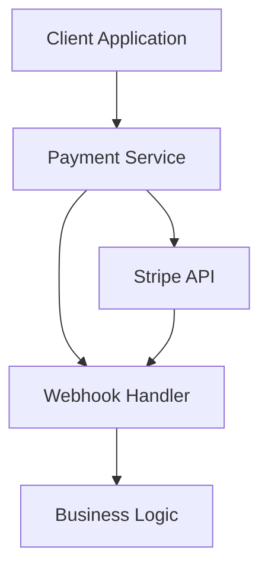

# Stripe Payment Integration Documentation

## 1. System Architecture

### Core Components



### Component Responsibilities

- **Client Layer** (`src/hooks/useStripePayment.ts`)
  - Payment intent creation
  - Payment confirmation
  - Error handling
  - Loading states

- **Service Layer** (`src/services/stripe/`)
  - Stripe client management
  - Payment operations
  - Webhook processing

- **API Layer** (`src/api/payment.ts`)
  - Payment endpoints
  - Request validation
  - Error responses

### Data Flow

1. Payment Creation:
   ```mermaid
   sequenceDiagram
       Client->>API: Create Payment Intent
       API->>Stripe: Create Intent Request
       Stripe->>API: Intent Response
       API->>Client: Client Secret
   ```

2. Payment Processing:
   ```mermaid
   sequenceDiagram
       Client->>Stripe: Confirm Payment
       Stripe->>Webhook: Payment Event
       Webhook->>System: Process Result
   ```

## 2. Implementation Guide

### Environment Setup

```bash
# Required environment variables
STRIPE_SECRET_KEY=sk_test_...
STRIPE_WEBHOOK_SECRET=whsec_...
STRIPE_PUBLISHABLE_KEY=pk_test_...
```

### Client Integration

```typescript
// Initialize Stripe
const stripe = await stripeService.initialize(STRIPE_PUBLISHABLE_KEY);

// Create payment
const { clientSecret } = await stripeService.createPaymentIntent({
  amount: 1000, // $10.00
  currency: 'usd'
});

// Confirm payment
const result = await stripe.confirmCardPayment(clientSecret, {
  payment_method: {
    card: elements.getElement('card'),
    billing_details: {
      name: 'Jenny Rosen'
    }
  }
});
```

### Webhook Setup

1. Configure webhook endpoint in Stripe Dashboard
2. Implement webhook handler:

```typescript
app.post('/webhook', express.raw({type: 'application/json'}), async (req, res) => {
  const sig = req.headers['stripe-signature'];
  const event = stripe.webhooks.constructEvent(req.body, sig, webhookSecret);
  
  switch (event.type) {
    case 'payment_intent.succeeded':
      handlePaymentSuccess(event.data.object);
      break;
    // Handle other events...
  }
});
```

## 3. Testing Framework

### Test Scenarios

1. Payment Creation
```typescript
describe('Payment Creation', () => {
  it('should create payment intent', async () => {
    const result = await createPaymentIntent({
      amount: 1000,
      currency: 'usd'
    });
    expect(result.client_secret).toBeDefined();
  });
});
```

### Test Cards

| Card Number | Scenario |
|------------|----------|
| 4242424242424242 | Success |
| 4000000000000002 | Decline |
| 4000000000009995 | Insufficient funds |
| 4000002500003155 | Authentication required |

## 4. API Reference

### Endpoints

#### POST /api/create-payment
Creates a payment intent

Request:
```json
{
  "amount": 1000,
  "currency": "usd",
  "metadata": {
    "orderId": "123"
  }
}
```

Response:
```json
{
  "success": true,
  "clientSecret": "pi_..._secret_...",
  "paymentIntentId": "pi_..."
}
```

#### POST /webhook
Handles Stripe webhooks

Headers:
```
stripe-signature: t=timestamp,v1=signature
```

## 5. Security Considerations

### Authentication
- Use HTTPS for all endpoints
- Validate webhook signatures
- Implement rate limiting
- Use environment variables for sensitive data

### Data Protection
- Never log full card details
- Encrypt sensitive data at rest
- Use TLS 1.2+ for data in transit
- Implement request validation

### Key Management
- Rotate webhook secrets periodically
- Use restricted API keys
- Monitor key usage
- Implement key rotation procedures

## 6. Deployment Guidelines

### Production Checklist

- [ ] Configure production API keys
- [ ] Set up webhook endpoints
- [ ] Enable SSL/TLS
- [ ] Configure error monitoring
- [ ] Set up logging
- [ ] Test webhook handling
- [ ] Configure rate limiting
- [ ] Set up alerts

### Monitoring

```typescript
// Example monitoring setup
const metrics = {
  paymentAttempts: new Counter(),
  paymentSuccess: new Counter(),
  paymentFailures: new Counter(),
  webhookLatency: new Histogram()
};

// Usage
metrics.paymentAttempts.inc();
metrics.webhookLatency.observe(duration);
```

### Performance Optimization

1. Implement caching where appropriate
2. Use connection pooling
3. Optimize webhook processing
4. Implement retry mechanisms
5. Use appropriate timeout values

### Scaling Considerations

- Use load balancing for webhook endpoints
- Implement idempotency
- Consider webhook fan-out patterns
- Use queue systems for async processing
- Implement proper error handling and retry logic